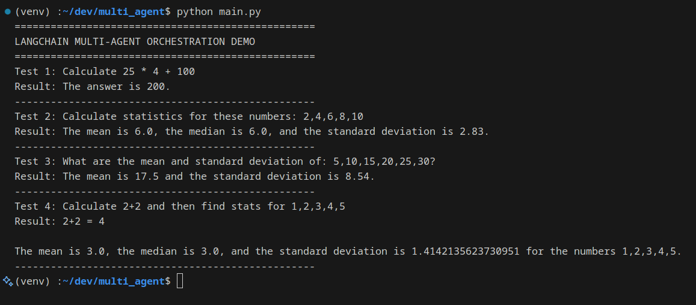

# LLM Orchestration

A simple proof of concept for multi-level LLM/tool orchestration built with langchain and langgraph that can perform mathematical calculations and statistical operations using Gemini-Flash-1.5 API.

---

## Features

* **Calculator Tool** – Performs arithmetic operations (add, subtract, multiplication, division, exponent, parantheses)
* **Statistics Tool** – Calculates mean, median and standard deviation for data using the calculator tool demonstrating tool chaining
* **Multi-Agent Orchestration** – Uses LangGraph to coordinate between tools
* **Web Interface** – Simple streamlit app for POC
* **Command Line Testing** - Includes simple demo run of command line that contains test cases

---

## Work Demo




---
## Quickstart

### 1. Clone repo

```bash
git clone https://github.com/DiwakarBasnet/llm_orchestration.git
```

### 2. Configure

```bash
pip install -r requirements.txt
```

### 3. Run demo

```bash
python main.py
```

### 4. Run streamlit app

```bash
streamlit run streamlit_app.py
```

---

## Workflow Example

**User Input:** Calculate statistics for 5, 11, 12, 18, 13, 21

**Agent Workflow:**

1. Orchestrator identifies statistics tool is needed
2. Statistics tool parses input numbers: [5,11,12,18,13,21]
3. Statistics tool uses calculator for:
    * Sum calculation
    * Mean calculation
    * Median calculation
    * Standard deviation calculation
4. Results are formatted and returned

---
